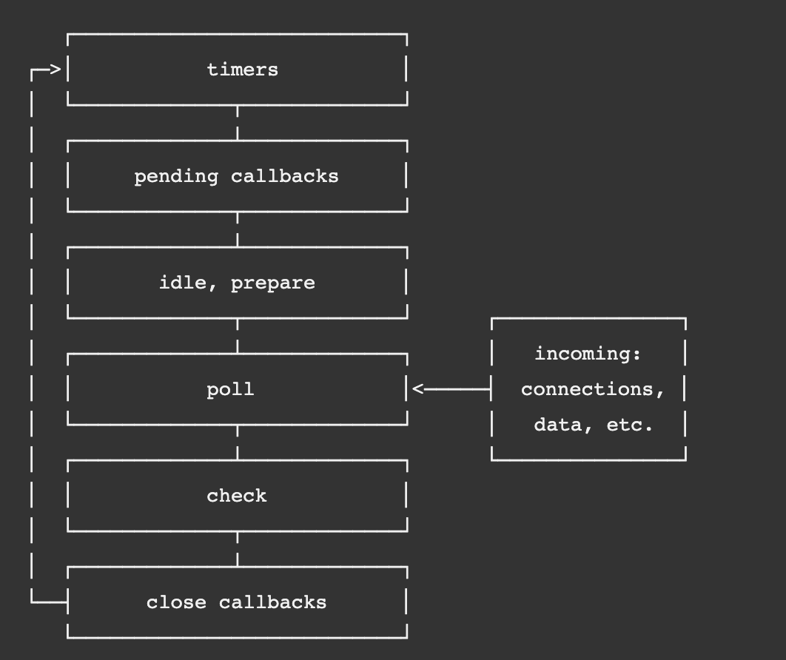

# Nodejs Javascript Database Cloud Related Interview Questions
```
 Node.js | Javascript | Database | Cloud 
```

> ## Basic Node.js Interview Questions And Answers For Beginners

### Q: What is Node.js, advantages of Node.js and how does it work?

`Ans:` Node.js is a JavaScript runtime built on Google Chrome's V8 JavaScript engine. It allows developers to run JavaScript on the server-side, which means that it can be used to create scalable, high-performance web applications.

Node.js works on an event-driven, non-blocking I/O model, which means that it uses a single thread to handle multiple connections, without blocking the execution of other requests. This makes it possible to build fast and responsive web applications that can handle large numbers of concurrent connections.

Because Node.js is based on JavaScript, front-end developers who are familiar with JavaScript can easily switch from the client-side to the server-side. It also has a large and strong developer community that has produced a wide range of modules and libraries that may be used to increase its functionalities.

The fact that Node.js is highly modular and can be used to create both server-side and client-side applications is one of its main benefits. Additionally, NPM (Node Package Manager), a built-in package manager, makes it simple to install, manage, and share reusable code libraries.

***Some of the features of Node.js are:***
- Asynchronous and event-driven
- Non-blocking I/O model
- Lightweight and efficient
- Cross-platform compatibility
- Built-in modules for HTTP, TCP, DNS, and more
- Large and active community of developers and contributors

### Q: In comparison to other back-end technologies, what advantages does Node.js offer?

`Ans:` Node.js has several benefits compared to other back-end technologies, like: 

1. **Speed and Scalability:** Node.js is fast and highly scalable because it is based on an event-driven, non-blocking I/O architecture. This indicates that it can manage many parallels at once without having performance issues.

2. **JavaScript:** Since Node.js is built on top of JavaScript, front-end developers can easily switch from the client-side to the server-side. Additionally, this means that JavaScript can be used on both the client and server sides, which could help in speeding up development and increasing productivity.

3. **NPM:** Node.js has a built-in package manager called NPM (Node Package Manager) that makes it easy to install, manage and share reusable code libraries. This can help to reduce development time and increase productivity.

4. **Large and Active Community:** Node.js has a large and active community of developers who have created a wide range of modules and libraries that can be used to extend its capabilities. This means that developers can easily find and use existing code libraries to speed up development and reduce errors.

5. **Cross-Platform:** Node.js can be used on a wide range of operating systems, including Windows, macOS, and Linux. This makes it a versatile choice for building applications that need to run on multiple platforms.

### Q: Why nodejs called event driven?
`Ans:` Node.js is called event-driven because it uses an event-driven programming model to handle asynchronous operations. In Node.js, most I/O operations are non-blocking and asynchronous, which means that the program can continue executing while the I/O operation is in progress.

When an asynchronous operation completes, it generates an event that is added to the event queue, and a callback function is registered to be executed when the event is processed. Node.js uses an event loop to continually check for events in the event queue and execute the associated callback functions.

By using this event-driven model, Node.js can handle large numbers of simultaneous connections and perform I/O operations efficiently, without blocking the execution of the program. This makes Node.js well-suited for building scalable and high-performance applications, especially those that involve real-time data processing or network communication.

### Q: What is event-driven programming?

`Ans:` Event-driven programming is a fundamental concept in Node.js, and it's one of the key features that makes Node.js such a powerful platform for building scalable and high-performance applications.

Event-driven programming is particularly useful in Node.js because it allows developers to create non-blocking, asynchronous applications that can handle a large number of concurrent connections without affecting performance. By using event-driven programming, developers can create applications that respond quickly and efficiently to user input, network activity, or other events, which is essential for building scalable and high-performance web applications.

### Q: What are different events in nodejs?

`Ans:` In Node.js, there are several types of events that can occur, and they can be categorized into two main groups: system events and custom events.

1. **System events:** These are events that are triggered by the Node.js runtime or the underlying operating system. Some examples of system events in Node.js include:

- `exit`: This event is emitted when the Node.js process is about to `exit`.
- `uncaughtException`: This event is emitted when an exception is thrown and not caught by any try/catch blocks.
- `SIGINT`: This event is emitted when the process receives a `SIGINT` signal, usually from pressing Ctrl+C.

2. **Custom events:** These are events that are created and triggered by the application code. Some examples of custom events in Node.js include:

- `request`: This event is emitted by the HTTP server module when a new HTTP request is received.
- `connection`: This event is emitted by the net module when a new client connection is established.
- `customEvent`: This is an example of a custom event that an application can create and emit whenever it needs to signal some sort of custom logic or behavior.

In Node.js, events are handled using the EventEmitter class, which provides a set of methods for registering event listeners, emitting events, and managing event handlers.


### Q: What is a callback function in Node.js?
`Ans:` A callback function is a function that is passed as an argument to another function and is executed when the original function has completed its task.

### Q: What is an event loop in Node.js?
`Ans:` Node.js manages asynchronous events through the usage of an event loop. It is a loop that continuously checks the event queue for new events and executes any associated callback functions.

The Node.js event loop is a fundamental part of the Node.js architecture and is responsible for handling asynchronous I/O operations. The event loop is a loop that continually checks for events in the event queue and executes any associated callback functions.


The event loop in Node.js consists of several phases, each with a specific set of tasks to perform. The phases of the event loop are:

1. **Timers Phase:** This phase checks the timer queue and executes any callbacks that are due to be executed. Callbacks can be added to the timer queue using the setTimeout() and setInterval() functions.

2. **Pending callbacks phase:** This phase executes any I/O callbacks that were deferred to the next iteration of the event loop. These callbacks are typically generated by the operating system, such as when a socket connection is ready for reading or writing.

3. **Idle, Prepare phases:** These are internal phases that are not usually visible to developers.

4. **Poll phase:** This phase is responsible for retrieving new I/O events from the operating system and adding them to the event queue. If there are no pending I/O operations, the event loop will block and wait for new events to arrive.

5. **Check phase:** This phase is used to execute any setImmediate() callbacks that are waiting to be executed. setImmediate() callbacks are executed after the current event loop iteration, even if there are other events in the event queue.

6. **Close callbacks phase:** This phase is responsible for executing any callbacks associated with closed resources, such as sockets or file descriptors.

The event loop in Node.js is designed to handle a large number of simultaneous connections and is well-suited for building scalable, high-performance applications. By using an event-driven architecture, Node.js can efficiently handle asynchronous I/O operations, making it an ideal choice for building network applications, real-time systems, and high-performance web servers.



### Q: What is the difference between callback and promise in Node.js?
`Ans:` Callback functions are used in Node.js to handle asynchronous code execution, while promises are used to handle asynchronous operations and return the results as a resolved or rejected value.

### Q: What is the purpose of the `require` keyword in Node.js?
`Ans:` The `require` keyword is used in Node.js to import modules or packages into the current file.

### Q: What is the difference between `require` and `import` in Node.js?
`Ans:` In Node.js, `require` is a CommonJS module system function used to load modules, while `import` is a newer feature in ECMAScript 6 (ES6) used to load modules in a native way.

Here are some key differences between `require` and `import`:

1. **Syntax:** The syntax for using `require` is `const module = require('module')`, while the syntax for using `import` is `import module from 'module'`.

2. **Functionality:** `require` is used to load modules synchronously, meaning the execution of the code is blocked until the module is loaded. In contrast, `import` is used to load modules asynchronously, meaning the module is loaded in the background and execution of the code continues without blocking.

3. **Scoping:** `require` creates a local scope for each module, meaning variables defined within a module are not accessible outside of that module. `import`, on the other hand, creates a lexical scope, which means that variables declared within a module can be accessed outside of that module if they are exported.

4. **Compatibility:** `require` is the older and more widely used way of loading modules in Node.js, and it is compatible with all versions of Node.js. `import`, on the other hand, is a newer feature introduced in ES6 and requires a newer version of Node.js (version 13.2.0 or later) to work.

Here is an example of using `require` and `import` to load a module in Node.js:

Using `require`:
```
const express = require('express');
const app = express();
```

Using `import`:
```
import express from 'express';
const app = express();
```

Overall, both `require` and `import` are used to load modules in Node.js, but `import` is a newer and more flexible way of loading modules that provides additional features such as asynchronous loading and lexical scoping.

### Q: `module.exports` vs `exports` in Node.js?
`Ans:` In Node.js, `module.exports` and `exports` are both used to export a module from a file to be used in another file, but they work differently.

Here's an overview of the difference between `module.exports` and `exports`:

1. **`module.exports`:** `module.exports` is an object that is the sole export of a module. It can be assigned to any value, such as a function or object, to be exported as the module. When `module.exports` is assigned a new value, it replaces the entire object that was originally assigned to it.

2. **`exports`:** `exports` is a shorthand for `module.exports`. It is a reference to the `module.exports` object. When `exports` is assigned a new value, it does not replace the entire object, but instead adds a new property to the `module.exports` object.

Here's an example to illustrate the difference:

```
// module.js

// This will replace the entire module.exports object with a new object
module.exports = {
  greet: function() {
    console.log('Hello!');
  }
};

// This will add a new property to the module.exports object
exports.goodbye = function() {
  console.log('Goodbye!');
};
```

```
// main.js

const myModule = require('./module');

myModule.greet(); // Output: "Hello!"
myModule.goodbye(); // Output: "Goodbye!"
```

In this example, `module.js` exports an object with a `greet` method using `module.exports`, and adds a `goodbye` method using `exports`. When `main.js` requires `module.js`, it can access both methods using the same object.

Overall, `module.exports` and `exports` are both used to export modules in Node.js, but `module.exports` is used when you want to export an entire object, while `exports` is used to add properties to the `module.exports` object.


### Q: What is middleware and How do we use it in Node.js?
`Ans:` Middleware in Node.js refers to a function that is executed between the request and response phases of an HTTP request-response cycle. It can be used to modify the request or response, or to perform additional processing on the request.

Middleware functions can perform tasks such as authentication, validation, logging, or error handling.

### Q: How to handle errors in Node.js? What strategies do we use for debugging and troubleshooting?
`Ans:` Errors in Node.js can be handled using try-catch blocks or by using the "error" event of the EventEmitter class.

To handle errors in Node.js applications, such as implementing error-handling middleware, using try-catch blocks, logging errors to a file or a database, and using tools such as the Node.js debugger or the `node-inspector` module to debug code. We should emphasize the importance of testing and continuous integration to catch errors early in the development process.

### Q: What is a package.json file in Node.js?
`Ans:` The `package.json` file is a core component of any Node.js project, and it serves as a manifest for the project. It contains various metadata about the project, such as the project name, version number, description, and author information. Additionally, it also lists all the dependencies and devDependencies that are required by the project, along with their specific version numbers.

The `package.json` file is used by Node.js to manage the project dependencies and ensure that the correct versions of each dependency are installed. This makes it easy to share the project with other developers, who can easily install all the required dependencies by running a single command.

### Q: What are the global variables in Node.js?
`Ans:` In Node.js, there are several global variables that are available to all modules without the need for requiring or importing them. These global variables include:

1. `global`: This variable is the global object in Node.js, similar to the `window` object in a web browser. It contains properties and methods that are available globally to all modules.

2. `process`: This variable is an object that provides information about the current Node.js process, such as the command-line arguments, environment variables, and current working directory.

3. `console`: This variable is an object that provides methods for printing messages to the console, such as `console.log()` and `console.error()`.

4. `Buffer`: This variable is a constructor function that provides a way to work with binary data in Node.js, such as reading or writing files in binary mode.

5. `setTimeout`, `setInterval`, and `setImmediate`: These are functions that allow you to schedule code to be executed at a later time or repeatedly at a set interval.

6. `__dirname` and `__filename`: These variables contain the absolute path of the directory and file, respectively, in which the current module is located.

Note that it is generally considered good practice to avoid using global variables in your Node.js code, as it can lead to conflicts and make your code harder to maintain. Instead, it's recommended to use module-level variables and pass them around as needed.


> ## Mid-Level Node.js Interview Questions and Answers

### Q: How can we debug a Node.js application?
`Ans:` Node.js applications can be debugged using the built-in Node.js debugger or by using third-party tools such as Visual Studio Code or WebStorm Debug.

### Q: What are the promises?
`Ans:` Promises are a fundamental concept in JavaScript and Node.js, and they are used to handle asynchronous operations in a more organized and predictable way.

A promise is an object that represents the eventual completion (or failure) of an asynchronous operation, and it provides a way to handle the result of that operation once it has completed. Promises have three states: `pending`, `fulfilled`, or `rejected`.

When a promise is created, it starts in a pending state. Once the asynchronous operation is complete, the promise is either fulfilled (if the operation completed successfully) or rejected (if the operation failed). If the promise is fulfilled, it returns the result of the operation, while if it is rejected, it returns an error.

In Node.js, promises are implemented using the built-in Promise object, which provides a set of methods for creating, chaining, and handling promises. Many Node.js APIs use promises as the primary way to handle asynchronous operations, including file system operations, network requests, and database interactions.

### Q: `Promise.all()`, `Promise.allSettled()`, and `Promise.race()` in Node.js?
`Ans:` `Promise.all()`, `Promise.allSettled()`, and `Promise.race()` are all Promise methods that allow you to work with multiple Promises in Node.js.

1. **`Promise.all()`**: This method takes an array of Promises and returns a Promise that resolves with an array of the resolved values from all the Promises, in the same order as the input Promises. If any of the input Promises reject, the entire `Promise.all()` call will reject with the first rejection reason.

Here's an example usage of `Promise.all()`:

```
const promise1 = Promise.resolve(1);
const promise2 = Promise.resolve(2);
const promise3 = Promise.resolve(3);

Promise.all([promise1, promise2, promise3])
  .then(values => console.log(values)); // Output: [1, 2, 3]
```

2. **`Promise.allSettled()`**: This method takes an array of Promises and returns a Promise that resolves with an array of objects that describe the state of each Promise, whether it is fulfilled or rejected. Each object has a `status` property that can be either `"fulfilled"` or `"rejected"`, and a `value` or `reason` property that contains the fulfillment value or rejection reason of the Promise.

Here's an example usage of `Promise.allSettled()`:

```
const promise1 = Promise.resolve(1);
const promise2 = Promise.reject('error');
const promise3 = Promise.resolve(3);

Promise.allSettled([promise1, promise2, promise3])
  .then(results => console.log(results));
  // Output: [{status: "fulfilled", value: 1}, {status: "rejected", reason: "error"}, {status: "fulfilled", value: 3}]
```

3. **`Promise.race()`**: This method takes an array of Promises and returns a Promise that resolves or rejects as soon as one of the Promises in the array resolves or rejects. The result of the first Promise to settle is passed to the resolve or reject handler of the `Promise.race()` call.

Here's an example usage of `Promise.race()`:

```
const promise1 = new Promise(resolve => setTimeout(resolve, 500, 'one'));
const promise2 = new Promise(resolve => setTimeout(resolve, 100, 'two'));

Promise.race([promise1, promise2])
  .then(value => console.log(value)); // Output: "two"
```

Overall, `Promise.all()`, `Promise.allSettled()`, and `Promise.race()` are useful for working with multiple Promises in different scenarios. Use `Promise.all()` when you want to wait for all Promises to resolve, `Promise.allSettled()` when you want to wait for all Promises to settle, and `Promise.race()` when you want to get the result of the first Promise to settle.

### Q: What are the two main API functions in Node.js?
`Ans:` Node.js provides two main types of APIs: Core APIs and Third-party APIs. Each of these APIs offers a different set of functions that can be used to build different types of applications. Here, we will focus on the two main API functions in Node.js Core API:

1. **Synchronous APIs:** Synchronous APIs in Node.js block the execution of the program until the task is complete. This means that the program will not continue executing until the task is finished. Synchronous APIs are usually simpler to use, but they can also be less efficient, especially if the task takes a long time to complete.

Example of a synchronous API function in Node.js:
```
const fs = require('fs');
const data = fs.readFileSync('/path/to/file', 'utf8');
```

2. **Asynchronous APIs:** Asynchronous APIs in Node.js allow the program to continue executing while the task is being performed in the background. This means that the program does not block while the task is being performed, and it can continue executing other code in the meantime. Asynchronous APIs are more efficient, especially for long-running tasks, but they can also be more complex to use.

Example of an asynchronous API function in Node.js:
```
const fs = require('fs');
fs.readFile('/path/to/file', 'utf8', (err, data) => {
  if (err) throw err;
  console.log(data);
});
```

In the example above, `fs.readFile` is an asynchronous API function that reads the contents of a file and returns the data in a callback function. The callback function is executed once the file has been read and the data is available, or if there was an error during the operation. This allows the program to continue executing other code while the file is being read in the background.

### Q: What is callback hell and how to avoid the callback hell?
`Ans:` Callback hell is a common problem in Node.js applications that occurs when we have multiple nested callbacks within each other, making the code difficult to read, understand, and maintain. This happens when we have asynchronous operations that depend on the results of other asynchronous operations, and we need to pass callbacks to each operation.

For example, imagine we need to read a file from disk, process the data, and then write the result to another file. Here's how the code might look with nested callbacks:

```
fs.readFile('/path/to/file', 'utf8', function(err, data) {
  if (err) {
    console.error(err);
  } else {
    processData(data, function(err, result) {
      if (err) {
        console.error(err);
      } else {
        fs.writeFile('/path/to/otherfile', result, function(err) {
          if (err) {
            console.error(err);
          } else {
            console.log('File written successfully');
          }
        });
      }
    });
  }
});
```

As we can see, the code becomes difficult to read and understand as the number of nested callbacks increases. This makes it harder to maintain and debug the code, and it can lead to errors and bugs.

To avoid callback hell, we can use techniques like named functions, Promises, and Async/Await to make our code more readable, organized, and maintainable.

Callback hell is a common problem in Node.js applications, where multiple levels of nested callbacks make the code difficult to read, maintain, and debug. This problem can be addressed in several ways:

1. **Use named functions:** Instead of defining anonymous functions as callbacks, define named functions that can be reused and make the code more readable and easier to understand.

***Example:***
```
fs.readFile('/path/to/file', 'utf8', function readData(err, data) {
  if (err) {
    throw err;
  }
  console.log(data);
});
```

2. **Use Promises:** Promises provide a more organized and predictable way to handle asynchronous operations and can help reduce the level of nesting in the code.

***Example:***
```
const fs = require('fs').promises;

fs.readFile('/path/to/file', 'utf8')
  .then(data => console.log(data))
  .catch(err => console.error(err));
```

3. **Use Async/Await:** Async/await is a newer feature in JavaScript that provides a cleaner and more readable syntax for handling asynchronous operations. It allows you to write asynchronous code that looks and behaves like synchronous code.

***Example:***
```
async function readFile() {
  try {
    const data = await fs.promises.readFile('/path/to/file', 'utf8');
    console.log(data);
  } catch (err) {
    console.error(err);
  }
}

readFile();
```

### Q: What is Crypto in Node.js?
`Ans:` In Node.js, the `crypto` module is a built-in module that provides cryptographic functionality, including encryption, decryption, hashing, and signing. It uses OpenSSL, a robust open-source toolkit for implementing secure communications in various applications, including web servers and web browsers.

The `crypto` module provides various cryptographic algorithms, including symmetric and asymmetric encryption, message digests (hashing), and digital signatures. Here are some examples of what you can do with the `crypto` module in Node.js:

1. Generate secure random numbers and strings.
2. Create and verify digital signatures.
3. Encrypt and decrypt data using various encryption algorithms, such as AES, DES, and RSA.
4. Compute message digests (hashes) of data using various hash algorithms, such as SHA-1, SHA-256, and MD5.
5. Implement key exchange protocols, such as Diffie-Hellman and ECDH.
6. Generate and verify certificates.

Here's an example of using the crypto module to generate a SHA-256 hash of a string:
```
const crypto = require('crypto');

const hash = crypto.createHash('sha256');
hash.update('hello world');
const digest = hash.digest('hex');
console.log(digest); // Output: 2ef7bde608ce5404e97d5f042f95f89f1c232871dfcc1de4a6b0cadb1d7d772
```

In this example, we create a hash object using the SHA-256 algorithm, update it with the input string "hello world," and then generate the digest (hash) in hexadecimal format.


> ## Advanced Node.js Interview Questions and Answers

### Q: What is clustering in Node.js?
`Ans:` Clustering in Node.js refers to the process of creating multiple worker processes to handle incoming requests, allowing the application to utilize all available CPU cores and improve performance and scalability.

### Q: How can we secure a Node.js application?
`Ans:` Some of the ways to secure a Node.js application are:

- Use HTTPS instead of HTTP for secure communication
- Implement authentication and authorization mechanisms
- Use input validation to prevent injection attacks
- Implement rate limiting to prevent brute-force attacks
- Keep all dependencies up to date to prevent security vulnerabilities

### Q: What is the difference between setImmediate() and setTimeout()?
`Ans:` setImmediate() is used to execute a function immediately after the current event loop, while setTimeout() is used to execute a function after a specified delay.

### Q: What are streams in Node.js?
`Ans:` Streams in Node.js are used to handle large amounts of data that cannot fit in memory. They provide a way to read and write data incrementally, in smaller chunks, without loading the entire data into memory.

### Q: What is the difference between readable and writable streams?
`Ans:` Readable streams are used to read data from a source, while writable streams are used to write data to a destination.

### Q: How can we implement authentication in a Node.js application?
`Ans:` Authentication in a Node.js application can be implemented using various techniques, such as:

- JSON Web Tokens (JWT)
- Passport.js middleware
- Session-based authentication
- Basic authentication
- OAuth2.0

### Q: Explain the difference between synchronous and asynchronous programming in Node.js? When would we choose one over the other?
`Ans:` The synchronous programming blocks the execution of the program until a task is completed, while asynchronous programming allows the program to continue executing while the task is being processed in the background. 

`Synchronous programming` is appropriate, such as when processing small amounts of data, and when `asynchronous programming` is more suitable, such as when working with I/O operations or large datasets.

### Q: Explain how Node.js handles concurrency and scalability? What techniques do we use to optimize performance?

`Ans:` Node.js is designed to handle large numbers of simultaneous connections by using a non-blocking I/O model and an event-driven architecture. 

We can optimize performance in a Node.js application, such as using a reverse proxy to load balance requests across multiple instances of the application, using a cache to reduce database queries, or implementing code that is optimized for a specific architecture or hardware.

### Q: How do we integrate Node.js with other technologies or platforms, such as databases, message queues, or front-end frameworks?
`Ans:` To integrate Node.js with other technologies or platforms, such as using ORM libraries like `Sequelize` or `TypeORM` to interact with databases, using message queue libraries like `RabbitMQ` or `Kafka` to enable asynchronous messaging, or using front-end frameworks like `React` or `Angular` to build client-side applications that communicate with Node.js back-ends via APIs.

### Q: How to ensure code quality and maintainability in Node.js applications? What coding standards or best practices do you follow?

`Ans:` To ensure code quality and maintainability in Node.js applications, such as using automated testing frameworks like `Jest` or `Mocha`, following coding standards like `ESLint` or `Prettier`, implementing design patterns like `MVC` or `Observer`, and using tools like `Git` or `GitHub` for version control and collaboration. We should emphasize the importance of writing clean, readable, and well-documented code that is easy to maintain and refactor.

### Q: Can you describe a complex Node.js project that you have led or contributed to? What challenges did you face, and how did you overcome them?

`Ans:` For my case: I have worked on a project that involved complex requirements or technical challenges, such as scaling to handle high traffic or integrating with multiple systems. 

The challenges that I faced, such as managing data consistency or optimizing performance, and we addressed those challenges, such as using caching, load balancing, or database sharding. 

This kind of challenges should be addressed and resolved with the teamwork and collaboration necessary to complete the project successfully, as well as the lessons learned from the experience.


-----------------------------------------------------------

> ## Javascript Questions and Answers

### Q: By default javascript is `synchronous` or `asynchronous`?
`Ans:` JavaScript is `synchronous` by default, meaning that it executes code in order and blocks other code from executing until it has completed. However, JavaScript also supports `asynchronous` programming through the use of callbacks, promises, and async/await, which allows for non-blocking I/O and efficient handling of time-consuming operations.

### Q: Explain the difference between `var`, `let`, and `const` in JavaScript?
`Ans:` `var` declares a variable globally or locally to a function, `let` declares a block-scoped variable, and `const` declares a block-scoped constant. The value of a variable declared with `const` cannot be reassigned.

### Q: What is closures in JavaScript? Give an example of when to use them?
`Ans:`  A closure is the wrapping up of function and it's surrounding variables with in a function or lexical scope. 

In the other way we can say, we can access the outer function scope from the inner function. 

So we can say, closure are created when functions are created. 

Example of closure: 
```
function outerMethod() {
     var name = 'Hello World';
     function innerMethod() {
          console.log(name);
     }
     innerMethod();
}
outerMethod();
```

So output of the above example is: Hello World

Here the name variable is in the scope of outer function and we are accessing from the inner function. This is closure. 

More understand about closure with it's lexical scoping:  

In JavaScript we can return a function within another function. Please check the below example.
```
function outerMethod() {
     var name = 'Hello World';
     function innerMethod() {
          console.log(name);
     }
     return innerMethod;
}
var result = outerMethod();

console.log(result);
```

Now guess what will be the output of result ? 

result will return the function, like the below: 
```
f innerMethod() {
     console.log(name);
}
```

Now if we call the result function then then what will be the output ?
```
result();
```

Here result variable is holding the "innerMethod" function. And within the function we are using "name" variable. But within the scope of function "name" variable does not declared. So as per this scenario console log output will undefined or null. 

But here also the output will be "Hello World", because of the closure. Because closure already bind both the function and variable within the lexical scope.

### Q: What are global variables in javascript?
`Ans:` In JavaScript, there are several global variables that are available in all contexts without the need for declaring them. These global variables include:

1. `undefined`: This variable represents the value "undefined", which is the default value for uninitialized variables and function arguments that are not provided.

2. `Infinity` and `-Infinity`: These variables represent positive and negative infinity, respectively.

3. `NaN`: This variable represents the special "not-a-number" value that results from invalid mathematical operations.

4. `Object`, `Array`, `String`, `Number`, `Boolean`, `Function`, `RegExp`, `Date`, and `Error`: These variables are constructor functions that can be used to create objects of the corresponding types.

5. `Math`: This variable is an object that provides mathematical constants and functions, such as `Math.PI` and `Math.sqrt()`.

6. `JSON`: This variable is an object that provides methods for encoding and decoding JSON data.

Note that it is generally considered good practice to avoid creating global variables in your JavaScript code, as it can lead to conflicts and make your code harder to maintain. Instead, it's recommended to use local variables and pass them around as needed.

### Q: What are the difference between `null` and `undefined` in javascript?
`Ans:` In JavaScript, `null` and `undefined` are both used to represent the absence of a value, but they have slightly different meanings and use cases.

`undefined` is a primitive value that is automatically assigned to variables that are declared but not initialized with a value, function arguments that are not provided, and the return value of a function that does not explicitly return a value. `undefined` can also be explicitly assigned to a variable or property to indicate the absence of a value.

`null`, on the other hand, is a value that represents a deliberate absence of any object value. It is typically used to indicate that a variable or property has no value or that a function returns no value. It can also be used to explicitly assign an empty or non-existent object reference.

Here are some differences between `null` and `undefined`:

1. **Type:** `undefined` is a primitive type, whereas `null` is an object type.

2. **Automatic assignment:** Variables that are declared but not initialized are automatically assigned the value `undefined`, whereas `null` must be assigned explicitly.

3. **Equality comparison:** `null` is equal only to `null` or `undefined`, whereas `undefined` is equal only to `undefined`.

4. **Type conversion:** `undefined` is converted to `NaN` when used in numeric contexts, whereas `null` is converted to `0`.

In general, `undefined` is used to represent an absence of any value, while `null` is used to represent an absence of any object value.

### Q: What is hosting in Javascript?
`Ans:` In JavaScript, "hosting" refers to the process by which variable and function declarations are moved to the top of their respective scopes by the JavaScript interpreter before the code is executed. This behavior is also sometimes referred to as "hoisting".

During the hosting process, the JavaScript interpreter scans through the code and identifies all variable and function declarations. It then moves these declarations to the top of their respective scopes, which means that they can be used before they are actually declared in the code.

However, it's important to note that only the declarations themselves are moved to the top of the scope, not the actual initialization or assignment of values. So, while a variable or function can be referenced before it is declared, any attempt to access the value of a variable or call a function before it is initialized or assigned will result in an error.

Here is an example of hosting in action:

```
function example() {
  console.log(a); // Output: undefined
  var a = 10;
  console.log(a); // Output: 10
}

example();
```

In this example, the variable `a` is declared and assigned a value of `10` after it is referenced in the first `console.log()` statement. However, due to hosting, the declaration of `a` is moved to the top of the function scope, so the first `console.log()` statement does not result in an error. Instead, it outputs `undefined`, which is the default value for uninitialized variables. The second `console.log()` statement outputs the expected value of `10`.

### Q: What are the new features of ES6?
`Ans:` ES6 (ECMAScript 2015) introduced several new features to the JavaScript language, including:

1. **let and const** - `let` and `const` provide a new way to declare variables in JavaScript. `let` declares block-scoped variables, while `const` declares block-scoped variables that cannot be reassigned.

2. **Arrow functions** - Arrow functions provide a concise syntax for defining functions in JavaScript, using the `=>` operator. They also automatically bind `this` to the parent context.

3. **Template literals** - Template literals provide a new way to create strings in JavaScript, using backticks (\`\`) instead of quotes. They also support multi-line strings and string interpolation.

4. **Spread operator** - The spread operator (`...`) allows an iterable (like an array) to be expanded in place where multiple arguments (for a function call) or multiple elements (for an array literal) are expected.

5. **Destructuring assignment** - Destructuring assignment allows you to extract data from arrays and objects using a syntax that mirrors the structure of the data.

6. **Classes** - Classes provide a new syntax for defining constructor functions and creating objects with shared methods.

7. **Modules** - ES6 introduced a standard module system for JavaScript, allowing code to be organized into separate files and imported/exported between them.

8. **Promises** - Promises provide a way to handle asynchronous operations in JavaScript, allowing you to chain together actions to be executed once a previous action is complete.

9. **Default parameters** - Default parameters allow you to specify a default value for a function parameter, which will be used if no argument is provided.

10. **Rest parameters** - Rest parameters allow you to pass an arbitrary number of arguments to a function as an array, using the `...` operator.

### Q: `call` vs `bind` vs `apply` in Javascript?
`Ans:` In JavaScript, `call()`, `bind()`, and `apply()` are methods that allow you to control the value of `this` within a function. They are used to set the value of `this` explicitly when invoking a function, and to pass arguments to the function.

The main differences between these three methods are:

1. `call()` - The `call()` method is used to call a function with a specified `this` value and arguments provided individually. In other words, `call()` sets the value of `this` and allows you to pass arguments as individual values. Here is an example:

```
function sayHello() {
  console.log(`Hello, ${this.name}!`);
}

const person = { name: 'John' };

sayHello.call(person); // Output: Hello, John!
```

2. `apply()` - The `apply()` method is similar to `call()`, but it takes arguments as an array. In other words, `apply()` sets the value of `this` and allows you to pass arguments as an array. Here is an example:

```
function sum(a, b) {
  console.log(a + b);
}

sum.apply(null, [2, 3]); // Output: 5
```

3. `bind()` - The `bind()` method is used to create a new function with a specified `this` value and arguments provided individually. In other words, `bind()` creates a new function with the specified `this` value and allows you to pass arguments as individual values. Here is an example:

```
function multiply(a, b) {
  console.log(a * b);
}

const multiplyByTwo = multiply.bind(null, 2);
multiplyByTwo(5); // Output: 10
```

In this example, `bind()` creates a new function called `multiplyByTwo` that multiplies its first argument by `2`. When `multiplyByTwo` is called with the argument `5`, it outputs `10`.

Overall, `call()`, `bind()`, and `apply()` are powerful tools for controlling the value of `this` and passing arguments to functions in JavaScript.

**Example:**
```
'use strict';

// this binding: Apply vs. Call vs. Bind Examples

// Call: Call invokes the function and allows you to pass in arguments one by one.
// Apply: Apply invokes the function and allows you to pass in arguments as an array.
// Bind: Bind returns a new function, allowing you to pass in a this array and any number of arguments.


var person1 = { firstName: 'Parameswar', lastName: 'Mondal' };
var person2 = { firstName: 'Gabbar', lastName: 'Sing' };

function say(greeting) {
    console.log(greeting + ' ' + this.firstName + ' ' + this.lastName);
}

// Call
say.call(person1, 'Hello'); // Hello Parameswar Mondal
say.call(person2, 'Hello'); // Hello Gabbar Sing


// Apply
say.apply(person1, ['Hello']); // Hello Parameswar Mondal
say.apply(person2, ['Hello']); // Hello Gabbar Sing


// Bind
var sayHelloParam = say.bind(person1, 'Hello');
var sayHelloGabbar = say.bind(person2, 'Hello');
sayHelloParam(); // Hello Parameswar Mondal
sayHelloGabbar(); // Hello Gabbar Sing
```

### Q: What is `map`, `filter` and `reducer` functions in Javascript?
`Ans:` In JavaScript, `map()`, `filter()`, and `reduce()` are three powerful array methods that allow you to perform complex operations on arrays.

1. `map()` - The `map()` method creates a new array by calling a function on each element of the original array. The function should return a new value that will be used as the corresponding element in the new array. Here's an example:

```javascript
const numbers = [1, 2, 3, 4, 5];
const doubled = numbers.map(num => num * 2);
console.log(doubled); // Output: [2, 4, 6, 8, 10]
```

2. `filter()` - The `filter()` method creates a new array by testing each element of the original array with a function. The function should return `true` or `false`, and only the elements that pass the test will be included in the new array. Here's an example:

```javascript
const numbers = [1, 2, 3, 4, 5];
const even = numbers.filter(num => num % 2 === 0);
console.log(even); // Output: [2, 4]
```

3. `reduce()` - The `reduce()` method applies a function to each element of the array to reduce it to a single value. The function takes two arguments: an accumulator and the current element of the array. The accumulator is initialized with an initial value, and the function is called on each element of the array, updating the accumulator with each iteration. Here's an example:

```javascript
const numbers = [1, 2, 3, 4, 5];
const sum = numbers.reduce((acc, num) => acc + num, 0);
console.log(sum); // Output: 15
```

In this example, we start with an initial value of `0` for the accumulator. The function adds each element of the array to the accumulator, and the final value of the accumulator is the sum of all the numbers in the array.

Overall, `map()`, `filter()`, and `reduce()` are powerful array methods that allow you to perform complex operations on arrays with concise and readable code.


---------------------------------------------------------

> ## Conceptual Questions

### Q: What is your experience with designing and developing scalable, fault-tolerant, and highly available back-end systems?

`Ans:` Designing and developing high-performance systems that can scale horizontally and vertically. For scalability and high performance we can use things such as load balancing, caching, database sharding, and message queuing to ensure high availability and fault tolerance.

### Q: What is database sharding ?

`Ans:` Database sharding is a technique used to partition large databases horizontally across multiple servers, also known as shards or nodes. In this technique, a database is split into smaller, more manageable pieces called shards. Each shard is stored on a separate server and contains only a portion of the data, and each server operates independently of the others. 
Sharding is typically used to address scalability issues, allowing a database to handle larger volumes of data and higher transaction rates. By distributing the data across multiple servers, the system can handle more queries and transactions in parallel, providing better performance and reducing the likelihood of a single point of failure. 
Sharding can be implemented using various methods, including range-based sharding, hash-based sharding, and composite sharding. In range-based sharding, data is partitioned based on a predefined range of values, such as date ranges or alphabetical ranges. In hash-based sharding, data is partitioned based on a hashing algorithm that evenly distributes data across the shards. Composite sharding combines both range and hash-based sharding methods. 
While sharding provides significant benefits in terms of scalability and performance, it also introduces additional complexity in managing a distributed system. Sharding requires careful consideration of data distribution and replication strategies, as well as fault tolerance and disaster recovery mechanisms. 

### Q: What is caching ?

`Ans:` Caching is the process of storing frequently used data in a high-speed temporary storage location, called a cache, to improve system performance and reduce latency. In computer systems, a cache is a small amount of memory that is used to store frequently accessed data so that it can be accessed quickly without needing to be fetched from the original source.
Caching is used in many different areas of computing, including web browsers, operating systems, databases, and file systems. For example, web browsers use caching to store recently accessed web pages, so that when a user revisits the same page, it can be quickly displayed without needing to be downloaded again from the internet.
Caching can improve system performance by reducing the amount of time it takes to access data. Since accessing data from a cache is much faster than retrieving it from the original source, using a cache can significantly reduce latency and improve the overall responsiveness of a system.
However, caching also introduces the risk of serving stale or outdated data. Therefore, it is important to manage cache expiration and invalidation to ensure that the cached data is always up to date. Additionally, caching can consume a significant amount of system resources, so it is important to carefully manage cache size and eviction policies to ensure that the system remains stable and responsive.

### Q: Can you explain the different types of databases you've worked with and the advantages and disadvantages of each?

`Ans:` I have experience with different types of databases such as SQL and NoSQL databases. It has the benefits and drawbacks of each, such as SQL's ACID compliance and NoSQL's horizontal scaling capabilities.

### Q: What are the advantages and disadvantages of SQL and NoSQL databases ?

`Ans:` SQL and NoSQL databases each have their own advantages and disadvantages, which are summarized below:
**Advantages of SQL databases:**
- SQL databases have been around for many years and are widely used, which means there is a large pool of experienced developers and administrators.
- SQL databases use a well-established standard query language (SQL) that is easy to learn and widely supported.
- SQL databases are highly structured, which makes them well-suited for complex data models and relationships.
- SQL databases provide strong consistency and transaction support, which is important for applications that require strict data integrity and reliability.

**Disadvantages of SQL databases:**
- SQL databases can be difficult to scale horizontally, which can limit their performance and scalability for large-scale applications.
- SQL databases require a fixed schema, which can make it difficult to accommodate changes to the data model.
- SQL databases can be expensive to license and maintain, especially for large enterprise deployments.
- SQL databases can be vulnerable to SQL injection attacks if not properly secured.

**Advantages of NoSQL databases:**
- NoSQL databases are highly scalable and can be easily distributed across multiple servers, making them well-suited for large-scale applications.
- NoSQL databases are schema-less, which makes it easier to accommodate changes to the data model.
- NoSQL databases can handle unstructured or semi-structured data types, such as documents and key-value pairs.
- NoSQL databases are often more flexible and performant than SQL databases for certain use cases, such as high write throughput and real-time data processing.

**Disadvantages of NoSQL databases:**
- NoSQL databases are less established and less widely used than SQL databases, which means there may be a smaller pool of experienced developers and administrators.
- NoSQL databases often lack a standard query language, which can make it more difficult to write complex queries and perform ad-hoc analysis.
- NoSQL databases may sacrifice strong consistency in favor of eventual consistency, which can lead to data inconsistencies if not carefully managed.
- NoSQL databases may require more complex data modeling and indexing, which can increase the complexity of application development.

### Q: What is SQL's ACID compliance?

`Ans:` ***ACID*** is an acronym that stands for Atomicity, Consistency, Isolation, and Durability. It is a set of properties that guarantee that database transactions are processed reliably and consistently. SQL's ACID compliance ensures that database transactions are processed in a way that guarantees data integrity and reliability.

**Atomicity:** A transaction is treated as a single, indivisible unit of work, which means that either all of the operations in the transaction are completed successfully, or none of them are. If a transaction fails for any reason, all changes made by that transaction are rolled back, leaving the database in the state it was in before the transaction began.

**Consistency:** A transaction is processed in a way that ensures that the database remains in a valid state before and after the transaction. This means that any changes made by the transaction must satisfy all constraints and integrity rules defined by the database schema.

**Isolation:** Each transaction is executed in isolation from other transactions, which means that the results of a transaction are not visible to other transactions until the transaction has been completed. This ensures that transactions do not interfere with each other and that the database remains consistent.

**Durability:** Once a transaction is completed successfully, the changes made by that transaction are permanently stored in the database and will survive system failures, power outages, or any other type of disruption.

In summary, SQL's ACID compliance ensures that database transactions are processed reliably and consistently, and that the data remains accurate and valid even in the face of system failures or other disruptions. This makes SQL databases a popular choice for applications that require strong data consistency and integrity, such as financial systems or e-commerce applications.


### Q: How do you ensure that the back-end system is secure and can handle potential security breaches?

`Ans:` Should implement security measures such as SSL encryption, firewalls, intrusion detection systems, and penetration testing. Also maintaining the strategies for handling security incidents and staying up-to-date with the latest security threats.

### Q: Describe your experience with cloud-based technologies and services such as AWS, Azure, and Google Cloud.

`Ans:` I have experience with cloud-based technologies and services such as AWS and Azure. Share your experience of how you've used these services to build scalable and reliable back-end systems.

### Q: What is your approach to debugging complex issues in the back-end system, and how do you prioritize and handle critical bugs?

`Ans:` There are several ways that we can use and do the debugging of the backend issues. Like: 
- We can use console.log and just print statements to the console. While this seems to work fine, it is not usually the best approach to take when debugging a complex Node.js application.
- To properly debug our applications, we’ll need a debugger-an application designed to step through code execution line by line, examine the states of variables. Generally I used a VSCode debugger for this.
- The debugger statement invokes any available debugging functionality, such as setting a breakpoint. If no debugging functionality is available, this statement has no effect.


### Q: How do you ensure that the back-end system meets performance and reliability requirements, and what metrics do you use to measure this?

`Ans:` Metrics such as latency, throughput, and error rates to measure performance and reliability. They may also discuss strategies for load testing and capacity planning.

Ensuring that the back-end system meets performance and reliability requirements is crucial for the success of any application. Here are some steps that can help ensure performance and reliability:

- Set performance and reliability requirements: Establish clear and measurable performance and reliability requirements for the back-end system. This will help you define what performance and reliability mean for your application and how they will be measured.
- Conduct load testing: Perform load testing to simulate real-world scenarios and evaluate the system's performance under various conditions, such as high traffic or heavy load. This will help you identify potential bottlenecks and performance issues.
- Monitor system metrics: Monitor key system metrics such as CPU usage, memory usage, network latency, and response time. This will help you identify issues before they become critical and proactively address them.
- Implement caching: Use caching to improve performance by storing frequently accessed data in a high-speed temporary storage location. This can help reduce latency and improve system responsiveness.
- Optimize database performance: Optimize database performance by using indexing, partitioning, and other techniques to improve query performance and reduce database load.
- Implement redundancy and failover: Implement redundancy and failover mechanisms to ensure system reliability and minimize downtime. This can include using load balancers, redundant servers, and failover clusters.
- Use monitoring and alerting tools: Use monitoring and alerting tools to receive real-time notifications when performance or reliability issues arise. This will help you quickly identify and resolve issues before they impact end-users.

### Q: Can you describe your experience with containerization technologies such as Docker and Kubernetes?

`Ans:` I have experience with containerization technologies such as Docker and Kubernetes. They may discuss how they've used these technologies to deploy and manage back-end systems and the benefits of containerization for scalability and flexibility.

### Q: What is your experience with implementing and working with RESTful APIs and microservices architectures?

`Ans:`  I have experience with implementing RESTful APIs and microservices architectures. They may discuss how they've used these architectures to build modular and scalable systems that can be easily extended and maintained. 

### Q: How do you handle and manage dependencies and versions of external libraries and packages used in the back-end system?

`Ans:` The candidate may discuss their experience with dependency management tools such as Maven or Gradle and their strategies for managing dependencies and versions.
To manage dependencies and versions of external libraries and packages in a backend system, developers often use package managers such as npm (for Node.js), pip (for Python), or Maven (for Java). These tools allow developers to specify the dependencies required by their application and automatically manage the installation and updating of those dependencies.

### Q: Can you provide an example of how you have effectively led and mentored a team of back-end developers in a previous role?

`Ans:` A strong candidate should have experience leading and mentoring a team of back-end developers. They may discuss how they've motivated and supported their team members, provided constructive feedback, and promoted a culture of continuous learning and improvement.

**Set clear goals and expectations:** As a leader, it's important to set clear goals and expectations for your team. This includes defining project milestones, deadlines, and quality standards.

**Provide regular feedback:** Regular feedback is essential for helping team members improve their skills and grow professionally. Provide both positive feedback for accomplishments and constructive feedback for areas that need improvement.

**Foster open communication:** Encourage open communication within your team. This includes holding regular team meetings, providing opportunities for feedback, and being approachable and accessible to team members.

**Lead by example:** As a leader, it's important to lead by example. This means demonstrating a strong work ethic, a positive attitude, and a commitment to quality and excellence.

**Encourage collaboration:** Encourage collaboration within your team. This includes providing opportunities for pair programming, code reviews, and team brainstorming sessions.

**Support ongoing learning and development:** Encourage ongoing learning and development among team members. This includes providing opportunities for training and development, sharing industry news and trends, and providing mentorship and guidance.

**Recognize and reward achievements:** Celebrate the achievements of your team members. This includes acknowledging milestones, giving public recognition for accomplishments, and providing opportunities for growth and advancement.


-------------------------------------------------

> ## Database(query) Related Interview Questions

### Q: What are MySQL database engines?

`Ans:` MySQL is a relational database management system that supports multiple storage engines, which are responsible for managing how data is stored and accessed in the database. Here are some of the most common storage engines in MySQL:

1. InnoDB - InnoDB is the default and most widely used storage engine in MySQL. It provides support for transactions, foreign keys, and row-level locking, which makes it suitable for high-concurrency applications that require data integrity.

2. MyISAM - MyISAM is another popular storage engine in MySQL. It is known for its fast read performance and full-text search capabilities. However, it does not support transactions or foreign keys, and it uses table-level locking, which can lead to contention in high-concurrency applications.

3. Memory - The Memory engine stores data in memory, providing extremely fast read and write performance. However, it does not support data persistence, and data is lost when the database is restarted.

4. CSV - The CSV engine stores data in comma-separated value files, making it easy to import and export data between MySQL and other applications. However, it does not support indexes or transactions, and it is not suitable for complex queries or large datasets.

5. Archive - The Archive engine is designed for storing large amounts of data that are infrequently accessed. It supports compression and can be used to create read-only archives of data.

There are many other storage engines available for MySQL, each with its own strengths and weaknesses. When choosing a storage engine for your application, it's important to consider your specific requirements for performance, scalability, and data integrity.

### Q: What is indexing in mysql?

`Ans:` In MySQL, indexing is a technique used to improve the performance of database queries. An index is a data structure that allows data to be quickly retrieved based on the values in one or more columns of a table.

When you create an index on a table in MySQL, the database creates a separate data structure that contains a sorted copy of the indexed column(s), along with pointers to the corresponding rows in the table. This makes it faster to search for and retrieve rows that match a particular condition or set of conditions.

Indexes can be created on one or more columns of a table, and can be either unique or non-unique. Unique indexes ensure that each value in the indexed column(s) is unique, while non-unique indexes allow duplicate values.

MySQL supports several types of indexes, including:

1. B-tree indexes - The most common type of index in MySQL, B-tree indexes store values in a balanced tree structure, allowing for fast search and retrieval.

2. Hash indexes - Hash indexes are designed for fast equality lookups, but are not as effective for range queries or sorting.

3. Full-text indexes - Full-text indexes are used to search for text in large blocks of text data, such as articles or documents.

4. Spatial indexes - Spatial indexes are used to optimize queries that involve geospatial data, such as maps or GPS coordinates.

Indexes can greatly improve the performance of database queries, especially for large tables with complex search conditions. However, they can also have drawbacks, such as increased storage requirements and slower write performance for heavily indexed tables. It's important to carefully consider your indexing strategy based on your specific application requirements.

### Q: Mysql query to create database?
`Ans:` To create a new database in MySQL, you can use the CREATE DATABASE statement followed by the name of the database you want to create. Here's the basic syntax:
```
CREATE DATABASE mydatabase;
```

### Q: Mysql query to create table?
`Ans:` To create a new table in MySQL, you can use the `CREATE TABLE` statement followed by the name of the table and a list of the columns you want to include in the table, along with their data types and any additional constraints. Here's the basic syntax:

```
CREATE TABLE table_name (
  column1 datatype constraints,
  column2 datatype constraints,
  ...
  columnN datatype constraints
);
```

For example, to create a new table called `users` with columns for `id`, `name`, and `email`, you can use the following query:

```
CREATE TABLE users (
  id INT PRIMARY KEY AUTO_INCREMENT,
  name VARCHAR(255) NOT NULL,
  email VARCHAR(255) NOT NULL
);
```

In this query, we've specified that the `id` column is the primary key and should automatically increment with each new row. We've also specified that the `name` and `email` columns should not allow NULL values.

You can also specify additional constraints on the columns, such as `UNIQUE`, `DEFAULT`, and `CHECK` constraints. Here's an example:

```
CREATE TABLE products (
  id INT PRIMARY KEY AUTO_INCREMENT,
  name VARCHAR(255) NOT NULL,
  price DECIMAL(10,2) DEFAULT 0.00,
  stock INT CHECK (stock >= 0),
  sku VARCHAR(50) UNIQUE
);
```

This query creates a new table called `products` with columns for `id`, `name`, `price`, `stock`, and `sku`. The `price` column has a default value of `0.00`, the `stock` column has a check constraint to ensure it is not negative, and the `sku` column has a unique constraint to ensure that each product has a unique SKU. 

Note that to run this query, you need to have the appropriate privileges to create tables on your MySQL server. If you are using a client tool such as phpMyAdmin, you can usually create a new table using a graphical interface.

### Q: How to find second highest salary in mysql?
`Ans:` To find the second highest salary in MySQL, you can use the `ORDER BY` and `LIMIT` clauses in your query. Here's an example query:

```
SELECT salary
FROM employee
ORDER BY salary DESC
LIMIT 1, 1;
```

In this query, replace `employee` with the name of your table and `salary` with the name of your salary column.

The `ORDER BY` clause sorts the rows in descending order based on the `salary` column. The `LIMIT` clause then selects the second row (which will be the second highest salary) by skipping the first row (which will be the highest salary) and selecting the next row.

Note that if there are duplicate salaries in the table, this query will return the second highest salary after the highest salary, which may not be unique. If you want to exclude the highest salary from the results, you can modify the `LIMIT` clause to skip the first two rows and select the third row:

```
SELECT salary
FROM employee
ORDER BY salary DESC
LIMIT 2, 1;
``` 

This query will skip the first two rows (which will be the two highest salaries) and select the third row (which will be the second highest salary).

### Q: Removing redundant data from mysql
`Ans:` To remove redundant data from a particular column in a MySQL table and display the remaining unique data, you can use the `DISTINCT` keyword with the `SELECT` statement. Here's an example query:

```
SELECT DISTINCT column_name
FROM table_name;
```

In this query, replace `column_name` with the name of the column you want to remove redundant data from, and `table_name` with the name of the table.

The `DISTINCT` keyword instructs MySQL to return only distinct (unique) values in the specified column. If there are any duplicate values in the column, only one instance of each value will be returned.

For example, suppose you have a `students` table with a `class` column that contains redundant data:

```
+----+-----------+-------+
| id | name      | class |
+----+-----------+-------+
|  1 | John Doe  | 10A   |
|  2 | Jane Doe  | 9B    |
|  3 | Bob Smith | 10A   |
|  4 | Sue Jones | 9B    |
|  5 | Tom Brown | 10B   |
+----+-----------+-------+
```

To remove redundant data from the `class` column and display the unique values, you could use the following query:

```
SELECT DISTINCT class
FROM students;
```

This would return the following result:

```
+-------+
| class |
+-------+
| 10A   |
| 9B    |
| 10B   |
+-------+
```


### Q: Difference between truncate and delete in mysql?
`Ans:` In MySQL, `TRUNCATE` and `DELETE` are two different ways to remove data from a table, but there are some important differences between them.

The main differences are:

1. **Behavior**: `TRUNCATE` removes all data from a table, while `DELETE` removes only the data that matches the specified conditions in the `WHERE` clause. If you don't specify a `WHERE` clause in a `DELETE` statement, all data in the table will be deleted, but this behavior can be dangerous if you accidentally forget to include the `WHERE` clause.

2. **Speed**: `TRUNCATE` is generally faster than `DELETE` because it removes all data from the table in one operation, while `DELETE` has to check each row to see if it matches the `WHERE` clause before deleting it. However, `TRUNCATE` is also more resource-intensive than `DELETE` because it resets the auto-increment counter and drops any indexes on the table.

3. **Logging**: `TRUNCATE` doesn't log individual row deletions, so it's not possible to recover the data after a `TRUNCATE` operation. `DELETE`, on the other hand, logs each row deletion in the binary log, making it possible to recover the data using point-in-time recovery techniques.

4. **Permissions**: `TRUNCATE` requires the `DROP` privilege on the table, while `DELETE` requires the `DELETE` privilege. If you don't have the necessary privileges, you won't be able to use either command.

In summary, `TRUNCATE` is faster and simpler than `DELETE`, but it's also more dangerous because it removes all data from the table without any conditions. If you want to remove specific rows from a table, `DELETE` is the safer choice because it allows you to specify conditions for which rows to delete. However, if you want to completely remove all data from a table and don't need to recover it later, `TRUNCATE` is a good option.

### Q: Create database in mongodb?
`Ans:` To create a database in MongoDB, you can use the `use` command followed by the name of the database you want to create. Here's an example:

```
use my_database
```

In this example, `my_database` is the name of the database you want to create. If the database doesn't exist, MongoDB will create it for you.

However, the `use` command doesn't actually create any collections or documents in the database. You need to insert at least one document into a collection to create it. For example, you could insert a document into a collection named `users`:

```
db.users.insertOne({ name: "John Doe", age: 30 })
```

In this example, `users` is the name of the collection, and `{ name: "John Doe", age: 30 }` is the document you want to insert. If the `users` collection doesn't exist, MongoDB will create it for you as part of the insert operation.

Keep in mind that in MongoDB, databases and collections are created dynamically when you first write data to them. You don't need to explicitly create them beforehand.

### Q: Query to create collection in mongodb?
`Ans:` In MongoDB, a collection is automatically created when you insert a document into it. However, if you want to explicitly create a collection, you can use the `createCollection` method.

Here's an example of creating a collection named `users`:

```
db.createCollection("users")
```

In this example, `users` is the name of the collection you want to create. You can also specify additional options, such as the maximum size of the collection, the maximum number of documents in the collection, and the storage engine to use.

For example, here's how you can create a collection with a maximum size of 100 megabytes and a maximum of 1000 documents:

```
db.createCollection("users", {
  capped: true,
  size: 100000000,
  max: 1000
})
```

In this example, the `capped` option specifies that the collection is a capped collection, which has a fixed size and automatically overwrites old documents when the collection reaches its maximum size. The `size` option specifies the maximum size of the collection in bytes, and the `max` option specifies the maximum number of documents in the collection.


### Q: How to create index in mongodb?
`Ans:` In MongoDB, you can create indexes to improve the performance of your queries. Indexes can help speed up read queries, but they can also slow down write queries, so it's important to choose the right indexes for your data and workload.

To create an index in MongoDB, you can use the `createIndex` method. The `createIndex` method takes two arguments: the name of the collection to create the index on, and an object that specifies the fields to index and any options for the index.

Here's an example of creating an index on the `username` field of a collection named `users`:

```
db.users.createIndex({ username: 1 })
```

In this example, the `{ username: 1 }` object specifies that the index should be created on the `username` field, and that the values should be sorted in ascending order (`1` means ascending, `-1` means descending).

You can also specify additional options for the index, such as whether to create a unique index, a sparse index, or a text index. Here's an example of creating a unique index on the `email` field:

```
db.users.createIndex({ email: 1 }, { unique: true })
```

In this example, the `{ email: 1 }` object specifies that the index should be created on the `email` field, and the `{ unique: true }` object specifies that the index should be a unique index.

### Q: Find second highest salary in mongodb?
`Ans:` In MongoDB, you can use the `sort` and `limit` methods to find the second highest salary.

Assuming you have a collection named `employees` with a `salary` field, here's an example query to find the second highest salary:

```
db.employees.find().sort({ salary: -1 }).skip(1).limit(1)
```

In this query, we're using the `find` method to retrieve all documents in the `employees` collection, then sorting them in descending order by the `salary` field using the `sort` method. We then skip the first document (which will have the highest salary) using the `skip` method, and limit the results to one document using the `limit` method. The resulting document will have the second highest salary.

### Q: Join two collections in mongodb?
`Ans:` In MongoDB, you can use the `$lookup` aggregation pipeline stage to perform a left outer join between two collections. Here's an example query to join the `orders` and `customers` collections on the `customer_id` field:

```
db.orders.aggregate([
   {
      $lookup:
         {
           from: "customers",
           localField: "customer_id",
           foreignField: "_id",
           as: "customer"
         }
   }
])
```

In this query, we're using the `aggregate` method to perform an aggregation operation on the `orders` collection. We then use the `$lookup` pipeline stage to join the `orders` collection with the `customers` collection. The `from` option specifies the name of the collection to join with, and the `localField` and `foreignField` options specify the fields to join on. Finally, the `as` option specifies the name of the new field that will contain the joined documents.

The resulting output will contain the fields from both collections, with the joined documents under the `customer` field.

### Q: How to delete documents by query efficiently in mongo?
`Ans:` In MongoDB, you can delete documents by query using the `deleteMany` method. Here's an example query to delete all documents in the `orders` collection with a `status` of `"cancelled"`:

```
db.orders.deleteMany({ status: "cancelled" })
```

This query will delete all documents in the `orders` collection that match the `{ status: "cancelled" }` query criteria.

To delete documents efficiently, you can consider creating an index on the field you're querying on. This will allow MongoDB to quickly find the documents to be deleted and delete them without scanning the entire collection.

Additionally, if you're deleting a large number of documents, you can use the `bulkWrite` method to perform the delete operation in batches. This can help reduce the impact on system resources and improve performance. Here's an example query to delete all documents in the `orders` collection with a `status` of `"cancelled"` in batches of 1000:

```
var counter = 0;
var batchSize = 1000;

db.orders.find({ status: "cancelled" }).forEach(function(order) {
    db.orders.deleteOne({ _id: order._id });
    counter++;

    if (counter % batchSize === 0) {
        db.getLastError(); // Forces a flush of pending writes
    }
});
```

In this query, we're using a loop to iterate over all documents in the `orders` collection with a `status` of `"cancelled"`, deleting each document using the `deleteOne` method. We're also flushing pending writes to disk after every batch of 1000 deletes to ensure that the operation doesn't consume too much memory.


